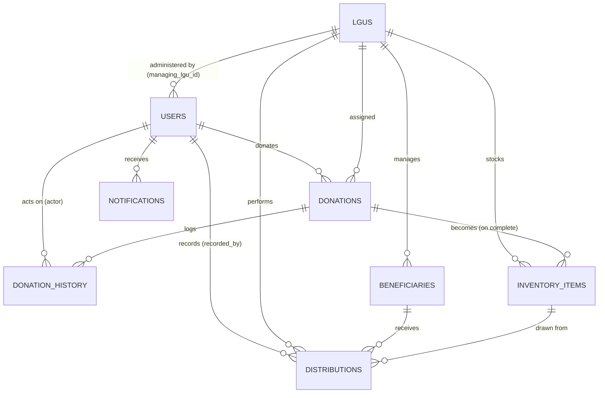

# ResQBites — Entity Relationships (ERD)

This document reflects the **actual ORM schema** in `app/db/models.py` (the single
source of truth — there are no migrations). The schema was deliberately **simplified
to 8 core entities**; the earlier 17-table version (gamification, audit logs, settings,
and a distributions header/line-item split) was removed to keep the model focused on
the food-flow workflow.

> **What changed in the simplification** (if you came from the old 17-table doc):
> - **Gamification is gone.** Removed `points_ledger`, `badges`, `user_badges`,
>   `reward_rules`, and the `users.points_balance` column. Donations no longer award
>   points or badges.
> - **Establishment data folded into `users`.** The old 1:1 `establishment_profiles`
>   table is gone; its fields now live on `users` as nullable `establishment_*` columns
>   (populated only for `role = establishment`).
> - **Distributions collapsed to one table.** The old `distributions` +
>   `distribution_items` split is now a single `distributions` row = one inventory item
>   drawn for one beneficiary (plus quantity). No more many-to-many.
> - **Dropped operational extras:** `audit_logs`, `system_settings`, `barangay_coverage`.

Types are SQLAlchemy/SQLite as defined in the model; `VARCHAR(n)` sizes come from
`String(n)`. Every table has an auto-increment integer `id` primary key.

- [Entity overview](#entity-overview)
- [ER diagram (Mermaid)](#er-diagram-mermaid)
- [Relationship map](#relationship-map)
- [Data dictionary](#data-dictionary)
- [Foreign-key summary](#foreign-key-summary)

---

## Entity overview

| # | Table | Model | Purpose |
|---|-------|-------|---------|
| 1 | `users` | `User` | All accounts (individual, establishment, lgu, admin). Establishment donors carry extra `establishment_*` fields. |
| 2 | `lgus` | `LGU` | Barangay-level food banks that receive/manage donations. |
| 3 | `donations` | `Donation` | Core donation records (lifecycle status). |
| 4 | `donation_history` | `DonationHistory` | Append-only audit trail of donation transitions. |
| 5 | `notifications` | `Notification` | Per-user in-app notifications. |
| 6 | `inventory_items` | `InventoryItem` | Food stock held by an LGU (created from a completed donation). |
| 7 | `beneficiaries` | `Beneficiary` | Recipients managed by an LGU. |
| 8 | `distributions` | `Distribution` | One handout: a quantity of one inventory item given to one beneficiary. |

## ER diagram (Mermaid)

A compact relationship view with the verbs on each connector. Render it at
[mermaid.live](https://mermaid.live), or use it as the reference for drawing the
diagram by hand in LucidChart (entity columns are in the [data dictionary](#data-dictionary) below).



> `||--o{` = one-to-many (zero or more); `||--o|` = one-to-(zero-or-)one.

## Relationship map

```
USERS
├── 1 : M ──── DONATIONS                       (donations.donor_id)
├── 1 : M ──── NOTIFICATIONS                   (notifications.user_id)
├── 1 : M ──── DONATION_HISTORY                (donation_history.actor_id, nullable)
└── 1 : M ──── DISTRIBUTIONS                   (distributions.recorded_by, nullable)

LGUS
├── 1 : M ──── USERS                           (users.managing_lgu_id) — LGU admin accounts
├── 1 : M ──── DONATIONS                       (donations.lgu_id, nullable)
├── 1 : M ──── INVENTORY_ITEMS                 (inventory_items.lgu_id)
├── 1 : M ──── BENEFICIARIES                   (beneficiaries.lgu_id)
└── 1 : M ──── DISTRIBUTIONS                   (distributions.lgu_id)

DONATIONS
├── 1 : M ──── DONATION_HISTORY                (donation_history.donation_id)
└── 1 : M ──── INVENTORY_ITEMS                 (inventory_items.donation_id, nullable)

BENEFICIARIES
└── 1 : M ──── DISTRIBUTIONS                   (distributions.beneficiary_id)

INVENTORY_ITEMS
└── 1 : M ──── DISTRIBUTIONS                   (distributions.inventory_item_id)
```

**Food flow:** `DONATIONS → (complete) → INVENTORY_ITEMS → DISTRIBUTIONS → BENEFICIARIES`.

## Data dictionary

Columns: **Type / Size / PK / FK / Nullable / Unique / Default / Notes**. `id` is
`INTEGER`, PK, auto-increment in every table (listed once per table).

### 1. `users`
| Column | Type | Size | PK | FK | Null | Uniq | Default | Notes |
|--------|------|------|----|----|------|------|---------|-------|
| id | INTEGER | – | Yes | No | No | Yes | auto | |
| email | VARCHAR | 255 | No | No | No | Yes | – | indexed; login id |
| password_hash | VARCHAR | 255 | No | No | No | No | – | bcrypt hash |
| role | ENUM | – | No | No | No | No | – | `UserRole`: individual, establishment, lgu, admin |
| first_name | VARCHAR | 120 | No | No | Yes | No | NULL | |
| last_name | VARCHAR | 120 | No | No | Yes | No | NULL | |
| phone | VARCHAR | 40 | No | No | Yes | No | NULL | |
| is_active | BOOLEAN | – | No | No | No | No | TRUE | |
| managing_lgu_id | INTEGER | – | No | Yes→`lgus.id` | Yes | No | NULL | LGU this account administers; `ON DELETE SET NULL` |
| establishment_name | VARCHAR | 200 | No | No | Yes | No | NULL | establishment role only |
| establishment_type | ENUM | – | No | No | Yes | No | NULL | `EstablishmentType`; establishment role only |
| establishment_address | VARCHAR | 400 | No | No | Yes | No | NULL | establishment role only |
| establishment_verified | BOOLEAN | – | No | No | No | No | FALSE | establishment role only |
| created_at | DATETIME | – | No | No | No | No | CURRENT_TIMESTAMP | |

### 2. `lgus`
| Column | Type | Size | PK | FK | Null | Uniq | Default | Notes |
|--------|------|------|----|----|------|------|---------|-------|
| id | INTEGER | – | Yes | No | No | Yes | auto | |
| name | VARCHAR | 200 | No | No | No | No | – | |
| address | VARCHAR | 400 | No | No | Yes | No | NULL | |
| contact_number | VARCHAR | 40 | No | No | Yes | No | NULL | |
| barangay | VARCHAR | 120 | No | No | Yes | No | NULL | indexed |
| verified | BOOLEAN | – | No | No | No | No | FALSE | |
| created_at | DATETIME | – | No | No | No | No | CURRENT_TIMESTAMP | |

### 3. `donations`
| Column | Type | Size | PK | FK | Null | Uniq | Default | Notes |
|--------|------|------|----|----|------|------|---------|-------|
| id | INTEGER | – | Yes | No | No | Yes | auto | |
| donor_id | INTEGER | – | No | Yes→`users.id` | No | No | – | indexed; `ON DELETE CASCADE` |
| lgu_id | INTEGER | – | No | Yes→`lgus.id` | Yes | No | NULL | indexed; `ON DELETE SET NULL` |
| title | VARCHAR | 200 | No | No | No | No | – | |
| description | TEXT | – | No | No | Yes | No | NULL | |
| quantity | VARCHAR | 120 | No | No | Yes | No | NULL | free-text |
| food_category | ENUM | – | No | No | No | No | – | `FoodCategory` (6 values) |
| quote | TEXT | – | No | No | Yes | No | NULL | donor message |
| photo_base64 | TEXT | – | No | No | Yes | No | NULL | base64 image; omitted from list views |
| pickup_location | VARCHAR | 400 | No | No | Yes | No | NULL | establishments only |
| dropoff_location | VARCHAR | 400 | No | No | Yes | No | NULL | |
| donation_method | ENUM | – | No | No | No | No | – | `DonationMethod`: pickup, dropoff |
| status | ENUM | – | No | No | No | No | pending | `DonationStatus` (6 values); indexed |
| scheduled_pickup_at | DATETIME | – | No | No | Yes | No | NULL | set on schedule |
| created_at | DATETIME | – | No | No | No | No | CURRENT_TIMESTAMP | |
| updated_at | DATETIME | – | No | No | No | No | CURRENT_TIMESTAMP | `ON UPDATE` now |

### 4. `donation_history`
| Column | Type | Size | PK | FK | Null | Uniq | Default | Notes |
|--------|------|------|----|----|------|------|---------|-------|
| id | INTEGER | – | Yes | No | No | Yes | auto | |
| donation_id | INTEGER | – | No | Yes→`donations.id` | No | No | – | indexed; `ON DELETE CASCADE` |
| action | VARCHAR | 120 | No | No | No | No | – | e.g. created, accepted, scheduled, completed |
| notes | TEXT | – | No | No | Yes | No | NULL | |
| actor_id | INTEGER | – | No | Yes→`users.id` | Yes | No | NULL | who acted; `ON DELETE SET NULL` |
| created_at | DATETIME | – | No | No | No | No | CURRENT_TIMESTAMP | |

### 5. `notifications`
| Column | Type | Size | PK | FK | Null | Uniq | Default | Notes |
|--------|------|------|----|----|------|------|---------|-------|
| id | INTEGER | – | Yes | No | No | Yes | auto | |
| user_id | INTEGER | – | No | Yes→`users.id` | No | No | – | indexed; `ON DELETE CASCADE` |
| title | VARCHAR | 200 | No | No | No | No | – | |
| message | TEXT | – | No | No | Yes | No | NULL | |
| is_read | BOOLEAN | – | No | No | No | No | FALSE | |
| created_at | DATETIME | – | No | No | No | No | CURRENT_TIMESTAMP | |

### 6. `inventory_items`
| Column | Type | Size | PK | FK | Null | Uniq | Default | Notes |
|--------|------|------|----|----|------|------|---------|-------|
| id | INTEGER | – | Yes | No | No | Yes | auto | |
| lgu_id | INTEGER | – | No | Yes→`lgus.id` | No | No | – | indexed; `ON DELETE CASCADE` |
| donation_id | INTEGER | – | No | Yes→`donations.id` | Yes | No | NULL | source donation; `ON DELETE SET NULL` |
| food_category | ENUM | – | No | No | No | No | – | `FoodCategory` |
| quantity | DECIMAL | 10,2 | No | No | No | No | 0 | |
| unit | VARCHAR | 40 | No | No | Yes | No | NULL | e.g. meals, kg |
| food_safety_status | ENUM | – | No | No | No | No | pending | `FoodSafetyStatus`: pending, passed, failed |
| expiry_date | DATETIME | – | No | No | Yes | No | NULL | |
| status | ENUM | – | No | No | No | No | in_stock | `InventoryStatus`: in_stock, distributed, expired; indexed |
| received_at | DATETIME | – | No | No | No | No | CURRENT_TIMESTAMP | |

### 7. `beneficiaries`
| Column | Type | Size | PK | FK | Null | Uniq | Default | Notes |
|--------|------|------|----|----|------|------|---------|-------|
| id | INTEGER | – | Yes | No | No | Yes | auto | |
| lgu_id | INTEGER | – | No | Yes→`lgus.id` | No | No | – | indexed; `ON DELETE CASCADE` |
| name | VARCHAR | 200 | No | No | No | No | – | |
| household_size | INTEGER | – | No | No | Yes | No | NULL | |
| barangay | VARCHAR | 120 | No | No | Yes | No | NULL | |
| address | VARCHAR | 400 | No | No | Yes | No | NULL | |
| contact | VARCHAR | 40 | No | No | Yes | No | NULL | |
| notes | TEXT | – | No | No | Yes | No | NULL | |
| created_at | DATETIME | – | No | No | No | No | CURRENT_TIMESTAMP | |

### 8. `distributions`
| Column | Type | Size | PK | FK | Null | Uniq | Default | Notes |
|--------|------|------|----|----|------|------|---------|-------|
| id | INTEGER | – | Yes | No | No | Yes | auto | |
| lgu_id | INTEGER | – | No | Yes→`lgus.id` | No | No | – | indexed; `ON DELETE CASCADE` |
| beneficiary_id | INTEGER | – | No | Yes→`beneficiaries.id` | No | No | – | `ON DELETE CASCADE` |
| inventory_item_id | INTEGER | – | No | Yes→`inventory_items.id` | No | No | – | `ON DELETE RESTRICT` (can't delete stock in use) |
| recorded_by | INTEGER | – | No | Yes→`users.id` | Yes | No | NULL | LGU user; `ON DELETE SET NULL` |
| quantity | DECIMAL | 10,2 | No | No | No | No | 0 | amount drawn from the inventory item |
| notes | TEXT | – | No | No | Yes | No | NULL | |
| distributed_at | DATETIME | – | No | No | No | No | CURRENT_TIMESTAMP | |

## Foreign-key summary

| Child table | Column | → Parent | On delete |
|-------------|--------|----------|-----------|
| `users` | managing_lgu_id | `lgus.id` | SET NULL |
| `donations` | donor_id | `users.id` | CASCADE |
| `donations` | lgu_id | `lgus.id` | SET NULL |
| `donation_history` | donation_id | `donations.id` | CASCADE |
| `donation_history` | actor_id | `users.id` | SET NULL |
| `notifications` | user_id | `users.id` | CASCADE |
| `inventory_items` | lgu_id | `lgus.id` | CASCADE |
| `inventory_items` | donation_id | `donations.id` | SET NULL |
| `beneficiaries` | lgu_id | `lgus.id` | CASCADE |
| `distributions` | lgu_id | `lgus.id` | CASCADE |
| `distributions` | beneficiary_id | `beneficiaries.id` | CASCADE |
| `distributions` | inventory_item_id | `inventory_items.id` | RESTRICT |
| `distributions` | recorded_by | `users.id` | SET NULL |
