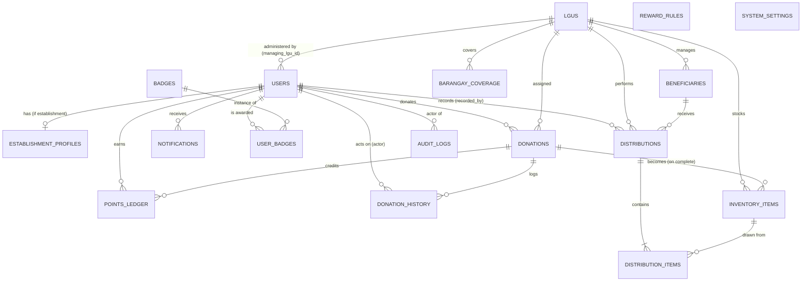

# ResQBites — Entity Relationships (ERD)

This document reflects the **actual ORM schema** in `app/db/models.py` (the single
source of truth — there are no migrations). It is grounded in the real tables, not
the idealized 8-entity sketch in `references/entity_relationships/SAMPLE_ENTITY_RELATIONSHIPS.md`.

> **How reality differs from the sample sketch** (worth knowing if you came from it):
> - **No separate `Donors` table.** Donor identity lives on `users` (the `role` enum +
>   `points_balance`). Establishment-specific data is a 1:1 `establishment_profiles` row.
> - **LGU linkage is reversed.** An LGU account is a `users` row whose
>   `managing_lgu_id` points to its `lgus` row (not `lgus.user_id` → users).
> - **Distributions are header + line items.** A `distributions` row has many
>   `distribution_items`, each drawing from one `inventory_items` row (a true
>   many-to-many between distributions and inventory).
> - **Gamification is split** into `points_ledger` (transactions), `badges` (catalog),
>   `user_badges` (awards), and `reward_rules` (config) — not one `rewards` table.
> - Extra operational tables exist: `donation_history`, `notifications`,
>   `barangay_coverage`, `system_settings`, `audit_logs`.

Types are SQLAlchemy/SQLite as defined in the model; `VARCHAR(n)` sizes come from
`String(n)`. Every table has an auto-increment integer `id` primary key.

- [Entity overview](#entity-overview)
- [ER diagram (Mermaid)](#er-diagram-mermaid)
- [Relationship map](#relationship-map)
- [Data dictionary](#data-dictionary)
- [Foreign-key summary](#foreign-key-summary)

---

## Entity overview

| # | Table | Model | Purpose |
|---|-------|-------|---------|
| 1 | `users` | `User` | All accounts (individual, establishment, lgu, admin). Holds donor points. |
| 2 | `establishment_profiles` | `EstablishmentProfile` | Extra info for establishment donors (1:1 with a user). |
| 3 | `lgus` | `LGU` | Barangay-level food banks that receive/manage donations. |
| 4 | `donations` | `Donation` | Core donation records (lifecycle status). |
| 5 | `donation_history` | `DonationHistory` | Append-only audit trail of donation transitions. |
| 6 | `notifications` | `Notification` | Per-user in-app notifications. |
| 7 | `inventory_items` | `InventoryItem` | Food stock held by an LGU (often created from a completed donation). |
| 8 | `beneficiaries` | `Beneficiary` | Recipients managed by an LGU. |
| 9 | `distributions` | `Distribution` | A distribution event to one beneficiary (header). |
| 10 | `distribution_items` | `DistributionItem` | Line items: quantity drawn from an inventory item. |
| 11 | `points_ledger` | `PointsLedger` | Point transactions awarded to users. |
| 12 | `badges` | `Badge` | Badge catalog (definitions/thresholds). |
| 13 | `user_badges` | `UserBadge` | Badges earned by users (join table). |
| 14 | `reward_rules` | `RewardRule` | Configurable points-per-donation rules (one active). |
| 15 | `barangay_coverage` | `BarangayCoverage` | Which barangays an LGU covers. |
| 16 | `system_settings` | `SystemSetting` | Key/value app settings (JSON value). |
| 17 | `audit_logs` | `AuditLog` | System-wide admin/action audit trail. |

## ER diagram (Mermaid)



> `||--o{` = one-to-many (zero or more); `||--o|` = one-to-(zero-or-)one;
> `||--|{` = one-to-(one-or-)many. `REWARD_RULES` and `SYSTEM_SETTINGS` are
> standalone config tables with no FKs.

## Relationship map

```
USERS
├── 1 : 0..1 ── ESTABLISHMENT_PROFILES        (establishment_profiles.user_id, unique)
├── 1 : M ──── DONATIONS                       (donations.donor_id)
├── 1 : M ──── NOTIFICATIONS                   (notifications.user_id)
├── 1 : M ──── POINTS_LEDGER                   (points_ledger.user_id)
├── 1 : M ──── USER_BADGES                     (user_badges.user_id)
├── 1 : M ──── DONATION_HISTORY                (donation_history.actor_id, nullable)
├── 1 : M ──── DISTRIBUTIONS                   (distributions.recorded_by, nullable)
└── 1 : M ──── AUDIT_LOGS                      (audit_logs.actor_id, nullable)

LGUS
├── 1 : M ──── USERS                           (users.managing_lgu_id) — LGU admin accounts
├── 1 : M ──── DONATIONS                       (donations.lgu_id, nullable)
├── 1 : M ──── INVENTORY_ITEMS                 (inventory_items.lgu_id)
├── 1 : M ──── BENEFICIARIES                   (beneficiaries.lgu_id)
├── 1 : M ──── DISTRIBUTIONS                   (distributions.lgu_id)
└── 1 : M ──── BARANGAY_COVERAGE               (barangay_coverage.lgu_id)

DONATIONS
├── 1 : M ──── DONATION_HISTORY                (donation_history.donation_id)
├── 1 : M ──── INVENTORY_ITEMS                 (inventory_items.donation_id, nullable)
└── 1 : M ──── POINTS_LEDGER                   (points_ledger.donation_id, nullable)

BENEFICIARIES
└── 1 : M ──── DISTRIBUTIONS                   (distributions.beneficiary_id)

DISTRIBUTIONS
└── 1 : M ──── DISTRIBUTION_ITEMS              (distribution_items.distribution_id)

INVENTORY_ITEMS
└── 1 : M ──── DISTRIBUTION_ITEMS              (distribution_items.inventory_item_id)

BADGES
└── 1 : M ──── USER_BADGES                     (user_badges.badge_id)

REWARD_RULES, SYSTEM_SETTINGS                  (standalone config — no FKs)
```

**Food flow:** `DONATIONS → (complete) → INVENTORY_ITEMS → DISTRIBUTION_ITEMS → DISTRIBUTIONS → BENEFICIARIES`.

## Data dictionary

Columns: **Type / Size / PK / FK / Nullable / Unique / Default / Notes**. `id` is
`INTEGER`, PK, auto-increment in every table (listed once per table).

### 1. `users`
| Column | Type | Size | PK | FK | Null | Uniq | Default | Notes |
|--------|------|------|----|----|------|------|---------|-------|
| id | INTEGER | – | Yes | No | No | Yes | auto | |
| email | VARCHAR | 255 | No | No | No | Yes | – | indexed; login id |
| password_hash | VARCHAR | 255 | No | No | No | No | – | bcrypt hash |
| role | ENUM | – | No | No | No | No | – | `UserRole`: individual, establishment, lgu, admin |
| first_name | VARCHAR | 120 | No | No | Yes | No | NULL | |
| last_name | VARCHAR | 120 | No | No | Yes | No | NULL | |
| phone | VARCHAR | 40 | No | No | Yes | No | NULL | |
| is_active | BOOLEAN | – | No | No | No | No | TRUE | |
| points_balance | INTEGER | – | No | No | No | No | 0 | donor reward points |
| managing_lgu_id | INTEGER | – | No | Yes→`lgus.id` | Yes | No | NULL | LGU this account administers; `ON DELETE SET NULL` |
| created_at | DATETIME | – | No | No | No | No | CURRENT_TIMESTAMP | |

### 2. `establishment_profiles`
| Column | Type | Size | PK | FK | Null | Uniq | Default | Notes |
|--------|------|------|----|----|------|------|---------|-------|
| id | INTEGER | – | Yes | No | No | Yes | auto | |
| user_id | INTEGER | – | No | Yes→`users.id` | No | Yes | – | 1:1; `ON DELETE CASCADE` |
| establishment_name | VARCHAR | 200 | No | No | No | No | – | |
| establishment_type | ENUM | – | No | No | No | No | – | `EstablishmentType`: restaurant, hotel, grocery, bakery, catering, other |
| address | VARCHAR | 400 | No | No | Yes | No | NULL | |
| verified | BOOLEAN | – | No | No | No | No | FALSE | |

### 3. `lgus`
| Column | Type | Size | PK | FK | Null | Uniq | Default | Notes |
|--------|------|------|----|----|------|------|---------|-------|
| id | INTEGER | – | Yes | No | No | Yes | auto | |
| name | VARCHAR | 200 | No | No | No | No | – | |
| address | VARCHAR | 400 | No | No | Yes | No | NULL | |
| contact_number | VARCHAR | 40 | No | No | Yes | No | NULL | |
| barangay | VARCHAR | 120 | No | No | Yes | No | NULL | indexed |
| latitude | FLOAT | – | No | No | Yes | No | NULL | for nearby search |
| longitude | FLOAT | – | No | No | Yes | No | NULL | for nearby search |
| verified | BOOLEAN | – | No | No | No | No | FALSE | |
| created_at | DATETIME | – | No | No | No | No | CURRENT_TIMESTAMP | |

### 4. `donations`
| Column | Type | Size | PK | FK | Null | Uniq | Default | Notes |
|--------|------|------|----|----|------|------|---------|-------|
| id | INTEGER | – | Yes | No | No | Yes | auto | |
| donor_id | INTEGER | – | No | Yes→`users.id` | No | No | – | indexed; `ON DELETE CASCADE` |
| lgu_id | INTEGER | – | No | Yes→`lgus.id` | Yes | No | NULL | indexed; `ON DELETE SET NULL` |
| title | VARCHAR | 200 | No | No | No | No | – | |
| description | TEXT | – | No | No | Yes | No | NULL | |
| quantity | VARCHAR | 120 | No | No | Yes | No | NULL | free-text |
| food_category | ENUM | – | No | No | No | No | – | `FoodCategory` (6 values) |
| quote | TEXT | – | No | No | Yes | No | NULL | donor message |
| photo_base64 | TEXT | – | No | No | Yes | No | NULL | base64 image; omitted from list views |
| pickup_location | VARCHAR | 400 | No | No | Yes | No | NULL | establishments only |
| dropoff_location | VARCHAR | 400 | No | No | Yes | No | NULL | |
| donation_method | ENUM | – | No | No | No | No | – | `DonationMethod`: pickup, dropoff |
| status | ENUM | – | No | No | No | No | pending | `DonationStatus` (6 values); indexed |
| scheduled_pickup_at | DATETIME | – | No | No | Yes | No | NULL | set on schedule |
| created_at | DATETIME | – | No | No | No | No | CURRENT_TIMESTAMP | |
| updated_at | DATETIME | – | No | No | No | No | CURRENT_TIMESTAMP | `ON UPDATE` now |

### 5. `donation_history`
| Column | Type | Size | PK | FK | Null | Uniq | Default | Notes |
|--------|------|------|----|----|------|------|---------|-------|
| id | INTEGER | – | Yes | No | No | Yes | auto | |
| donation_id | INTEGER | – | No | Yes→`donations.id` | No | No | – | indexed; `ON DELETE CASCADE` |
| action | VARCHAR | 120 | No | No | No | No | – | e.g. created, accepted, scheduled, completed |
| notes | TEXT | – | No | No | Yes | No | NULL | |
| actor_id | INTEGER | – | No | Yes→`users.id` | Yes | No | NULL | who acted; `ON DELETE SET NULL` |
| created_at | DATETIME | – | No | No | No | No | CURRENT_TIMESTAMP | |

### 6. `notifications`
| Column | Type | Size | PK | FK | Null | Uniq | Default | Notes |
|--------|------|------|----|----|------|------|---------|-------|
| id | INTEGER | – | Yes | No | No | Yes | auto | |
| user_id | INTEGER | – | No | Yes→`users.id` | No | No | – | indexed; `ON DELETE CASCADE` |
| title | VARCHAR | 200 | No | No | No | No | – | |
| message | TEXT | – | No | No | Yes | No | NULL | |
| is_read | BOOLEAN | – | No | No | No | No | FALSE | |
| created_at | DATETIME | – | No | No | No | No | CURRENT_TIMESTAMP | |

### 7. `inventory_items`
| Column | Type | Size | PK | FK | Null | Uniq | Default | Notes |
|--------|------|------|----|----|------|------|---------|-------|
| id | INTEGER | – | Yes | No | No | Yes | auto | |
| lgu_id | INTEGER | – | No | Yes→`lgus.id` | No | No | – | indexed; `ON DELETE CASCADE` |
| donation_id | INTEGER | – | No | Yes→`donations.id` | Yes | No | NULL | source donation; `ON DELETE SET NULL` |
| food_category | ENUM | – | No | No | No | No | – | `FoodCategory` |
| quantity | DECIMAL | 10,2 | No | No | No | No | 0 | |
| unit | VARCHAR | 40 | No | No | Yes | No | NULL | e.g. meals, kg |
| food_safety_status | ENUM | – | No | No | No | No | pending | `FoodSafetyStatus`: pending, passed, failed |
| expiry_date | DATETIME | – | No | No | Yes | No | NULL | |
| status | ENUM | – | No | No | No | No | in_stock | `InventoryStatus`: in_stock, distributed, expired; indexed |
| received_at | DATETIME | – | No | No | No | No | CURRENT_TIMESTAMP | |

### 8. `beneficiaries`
| Column | Type | Size | PK | FK | Null | Uniq | Default | Notes |
|--------|------|------|----|----|------|------|---------|-------|
| id | INTEGER | – | Yes | No | No | Yes | auto | |
| lgu_id | INTEGER | – | No | Yes→`lgus.id` | No | No | – | indexed; `ON DELETE CASCADE` |
| name | VARCHAR | 200 | No | No | No | No | – | |
| household_size | INTEGER | – | No | No | Yes | No | NULL | |
| barangay | VARCHAR | 120 | No | No | Yes | No | NULL | |
| address | VARCHAR | 400 | No | No | Yes | No | NULL | |
| contact | VARCHAR | 40 | No | No | Yes | No | NULL | |
| notes | TEXT | – | No | No | Yes | No | NULL | |
| created_at | DATETIME | – | No | No | No | No | CURRENT_TIMESTAMP | |

### 9. `distributions`
| Column | Type | Size | PK | FK | Null | Uniq | Default | Notes |
|--------|------|------|----|----|------|------|---------|-------|
| id | INTEGER | – | Yes | No | No | Yes | auto | |
| lgu_id | INTEGER | – | No | Yes→`lgus.id` | No | No | – | indexed; `ON DELETE CASCADE` |
| beneficiary_id | INTEGER | – | No | Yes→`beneficiaries.id` | No | No | – | `ON DELETE CASCADE` |
| recorded_by | INTEGER | – | No | Yes→`users.id` | Yes | No | NULL | LGU user; `ON DELETE SET NULL` |
| notes | TEXT | – | No | No | Yes | No | NULL | |
| distributed_at | DATETIME | – | No | No | No | No | CURRENT_TIMESTAMP | |

### 10. `distribution_items`
| Column | Type | Size | PK | FK | Null | Uniq | Default | Notes |
|--------|------|------|----|----|------|------|---------|-------|
| id | INTEGER | – | Yes | No | No | Yes | auto | |
| distribution_id | INTEGER | – | No | Yes→`distributions.id` | No | No | – | `ON DELETE CASCADE` |
| inventory_item_id | INTEGER | – | No | Yes→`inventory_items.id` | No | No | – | `ON DELETE RESTRICT` (can't delete stock in use) |
| quantity | DECIMAL | 10,2 | No | No | No | No | 0 | drawn from the inventory item |

### 11. `points_ledger`
| Column | Type | Size | PK | FK | Null | Uniq | Default | Notes |
|--------|------|------|----|----|------|------|---------|-------|
| id | INTEGER | – | Yes | No | No | Yes | auto | |
| user_id | INTEGER | – | No | Yes→`users.id` | No | No | – | indexed; `ON DELETE CASCADE` |
| donation_id | INTEGER | – | No | Yes→`donations.id` | Yes | No | NULL | `ON DELETE SET NULL` |
| points | INTEGER | – | No | No | No | No | – | +/- points |
| reason | VARCHAR | 200 | No | No | Yes | No | NULL | |
| created_at | DATETIME | – | No | No | No | No | CURRENT_TIMESTAMP | |

### 12. `badges`
| Column | Type | Size | PK | FK | Null | Uniq | Default | Notes |
|--------|------|------|----|----|------|------|---------|-------|
| id | INTEGER | – | Yes | No | No | Yes | auto | |
| code | VARCHAR | 60 | No | No | No | Yes | – | stable identifier |
| name | VARCHAR | 120 | No | No | No | No | – | |
| description | TEXT | – | No | No | Yes | No | NULL | |
| threshold_points | INTEGER | – | No | No | No | No | 0 | points needed |

### 13. `user_badges`
| Column | Type | Size | PK | FK | Null | Uniq | Default | Notes |
|--------|------|------|----|----|------|------|---------|-------|
| id | INTEGER | – | Yes | No | No | Yes | auto | |
| user_id | INTEGER | – | No | Yes→`users.id` | No | No* | – | indexed; `ON DELETE CASCADE` |
| badge_id | INTEGER | – | No | Yes→`badges.id` | No | No* | – | `ON DELETE CASCADE` |
| awarded_at | DATETIME | – | No | No | No | No | CURRENT_TIMESTAMP | |

\* Composite unique constraint `uq_user_badge (user_id, badge_id)` — a user holds each badge at most once.

### 14. `reward_rules`
| Column | Type | Size | PK | FK | Null | Uniq | Default | Notes |
|--------|------|------|----|----|------|------|---------|-------|
| id | INTEGER | – | Yes | No | No | Yes | auto | |
| name | VARCHAR | 120 | No | No | No | No | – | |
| points_per_donation | INTEGER | – | No | No | No | No | 10 | |
| active | BOOLEAN | – | No | No | No | No | TRUE | indexed; one active rule used |
| created_at | DATETIME | – | No | No | No | No | CURRENT_TIMESTAMP | |

### 15. `barangay_coverage`
| Column | Type | Size | PK | FK | Null | Uniq | Default | Notes |
|--------|------|------|----|----|------|------|---------|-------|
| id | INTEGER | – | Yes | No | No | Yes | auto | |
| lgu_id | INTEGER | – | No | Yes→`lgus.id` | No | No* | – | indexed; `ON DELETE CASCADE` |
| barangay | VARCHAR | 120 | No | No | No | No* | – | |

\* Composite unique constraint `uq_lgu_barangay (lgu_id, barangay)`.

### 16. `system_settings`
| Column | Type | Size | PK | FK | Null | Uniq | Default | Notes |
|--------|------|------|----|----|------|------|---------|-------|
| id | INTEGER | – | Yes | No | No | Yes | auto | |
| key | VARCHAR | 120 | No | No | No | Yes | – | |
| value | JSON | – | No | No | Yes | No | NULL | structured value |

### 17. `audit_logs`
| Column | Type | Size | PK | FK | Null | Uniq | Default | Notes |
|--------|------|------|----|----|------|------|---------|-------|
| id | INTEGER | – | Yes | No | No | Yes | auto | |
| actor_id | INTEGER | – | No | Yes→`users.id` | Yes | No | NULL | `ON DELETE SET NULL` |
| action | VARCHAR | 120 | No | No | No | No | – | |
| entity_type | VARCHAR | 60 | No | No | Yes | No | NULL | |
| entity_id | INTEGER | – | No | No | Yes | No | NULL | not a DB-level FK |
| detail | JSON | – | No | No | Yes | No | NULL | |
| created_at | DATETIME | – | No | No | No | No | CURRENT_TIMESTAMP | |

## Foreign-key summary

| Child table | Column | → Parent | On delete |
|-------------|--------|----------|-----------|
| `users` | managing_lgu_id | `lgus.id` | SET NULL |
| `establishment_profiles` | user_id | `users.id` | CASCADE |
| `donations` | donor_id | `users.id` | CASCADE |
| `donations` | lgu_id | `lgus.id` | SET NULL |
| `donation_history` | donation_id | `donations.id` | CASCADE |
| `donation_history` | actor_id | `users.id` | SET NULL |
| `notifications` | user_id | `users.id` | CASCADE |
| `inventory_items` | lgu_id | `lgus.id` | CASCADE |
| `inventory_items` | donation_id | `donations.id` | SET NULL |
| `beneficiaries` | lgu_id | `lgus.id` | CASCADE |
| `distributions` | lgu_id | `lgus.id` | CASCADE |
| `distributions` | beneficiary_id | `beneficiaries.id` | CASCADE |
| `distributions` | recorded_by | `users.id` | SET NULL |
| `distribution_items` | distribution_id | `distributions.id` | CASCADE |
| `distribution_items` | inventory_item_id | `inventory_items.id` | RESTRICT |
| `points_ledger` | user_id | `users.id` | CASCADE |
| `points_ledger` | donation_id | `donations.id` | SET NULL |
| `user_badges` | user_id | `users.id` | CASCADE |
| `user_badges` | badge_id | `badges.id` | CASCADE |
| `barangay_coverage` | lgu_id | `lgus.id` | CASCADE |
| `audit_logs` | actor_id | `users.id` | SET NULL |

> `reward_rules` and `system_settings` have no foreign keys. `audit_logs.entity_id`
> is a soft pointer (no DB constraint) so logs survive deletion of the referenced row.
